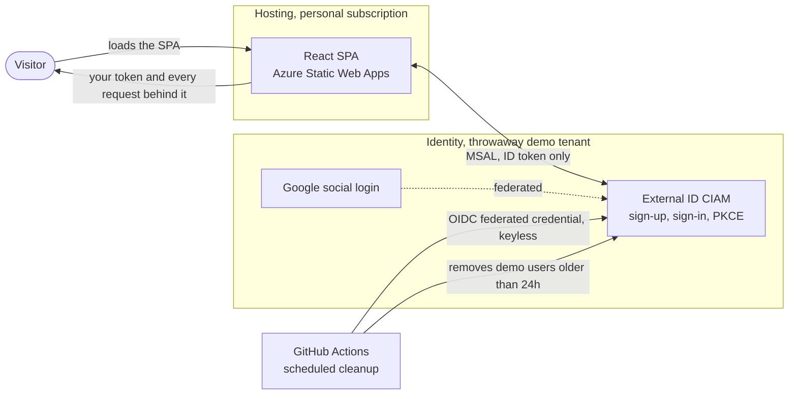

# The Identity Playground

Identity work is invisible in production. This site makes it visible: sign in against a
real Microsoft Entra tenant, then read the token that came back and every request that
produced it.

Live at https://theidentityplayground.com

Built by Steven Flanagan.

## Status

Module 1, the token inspector, is built and deployed. It reads the visitor's own ID token
and annotates every claim. The sign-in that produced it sits on a timeline built from real
captures against this tenant. Nothing on it is estimated.

The other six modules are not built. The roadmap is on the homepage.

The link above is the only place the site is published. It runs a live sign-up form. The
public-readiness checklist in [the build spec](identity-playground-spec.md) passed on
20 July 2026.

Demo accounts are deleted between 24 and 30 hours after they are created: a 24-hour TTL,
swept by a scheduled job every six hours. The job has run unattended and reported
correctly. It has not yet deleted anything, because no account has been old enough, so the
deletion path itself is the one part still unproven.

## Why there are three tenants

| Tenant | Role |
|---|---|
| External ID | Customer sign-up and sign-in. Everything a visitor touches. |
| Demo workforce | Created, not yet used. Employees, B2B guests, and SCIM land here from Phase 2. |
| Personal | Never issues a token to anyone. It owns the Azure subscription that pays for hosting. |

Visitors only ever authenticate against a throwaway demo tenant. Hosting lives in one
resource group in a personal subscription. A DNS zone and a static file host hold no
identity.

No real account or record belongs in either demo tenant. Every demo account is assumed
compromised.

## Architecture



Identity and hosting stay separate on purpose. The scheduled cleanup is the one thing that
crosses tenants, and it holds no secret to do it.

React SPA on Azure Static Web Apps, deployed from `main` by GitHub Actions. Entra does the
identity work. There is an Azure Functions project in `api/`, currently one health
endpoint; the front end calls no backend yet.

```
web/       React SPA (Vite, Tailwind, TypeScript)
api/       Azure Functions (TypeScript). One health endpoint so far
scripts/   PowerShell and the Graph SDK for demo account cleanup, plus a HAR-to-timings helper
docs/      Architecture, tenant setup, decision index
```

More in [docs/architecture.md](docs/architecture.md).

## Running it

```bash
npm install --prefix web
npm run dev --prefix web      # http://localhost:5173
npm test --prefix web
```

No configuration and no secrets. Sign-in works against the live tenant from localhost. The
tenant ID and client ID are compiled in because neither is a secret: both travel in every
authorize request and sit in the token. A client secret cannot appear here at all, since
this is a public client using PKCE.

## Design and decisions

[identity-playground-spec.md](identity-playground-spec.md) is the build spec: module
designs, security rules, phase gates. [docs/decisions/](docs/decisions/) indexes them,
each a short ADR of what was chosen and what was rejected. None remain open.
