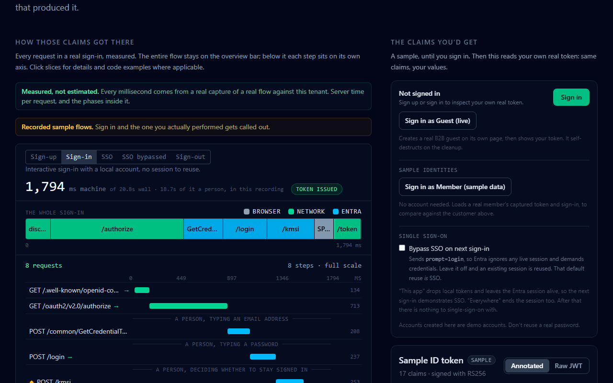
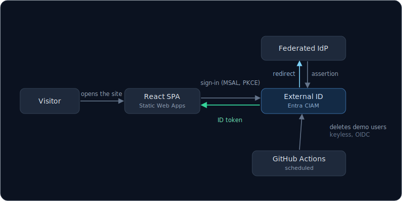

# The Identity Playground

Identity work is invisible in production. This site makes it visible: sign in against a
real Microsoft Entra tenant, then read the token that came back and every request that
produced it.

Live at https://theidentityplayground.com

<p align="center">
  
</p>

No account needed for that. Regenerate it with `npm run capture --prefix web`.

Built by Steven Flanagan.

## Status

Modules 1 and 2 are built and deployed.

Module 1, the token inspector, reads the visitor's own ID token and annotates every claim.
The sign-in that produced it sits on a timeline built from real captures against this
tenant. Nothing on it is estimated.

Module 2 puts three account types side by side: a customer, an employee, and a B2B guest.
The customer and the guest are live sign-ins that mint real tokens. The employee is a
captured sample, because a visitor cannot be an employee. All three drive the inspector,
the timeline, and a map of what each one can reach.

The other five modules are not built. The roadmap is on the homepage.

It runs a live sign-up form, and the guest door creates a real directory object. Nothing
linked to either until the public-readiness checklist in
[the build spec](identity-playground-spec.md) passed, on 20 July 2026.

Demo accounts are deleted between 24 and 30 hours after they are created: a 24-hour TTL,
swept by scheduled jobs holding no stored credential. Both sweeps run unattended, and both
have removed and permanently purged real expired accounts.

## Why there are three tenants

| Tenant | Role |
|---|---|
| External ID | Customer sign-up and sign-in. Everything a visitor touches. |
| Demo workforce | Module 2's employee and the B2B guests visitors create. SCIM lands here later. |
| Personal | Never issues a token to anyone. It owns the Azure subscription that pays for hosting. |

Visitors only ever authenticate against a throwaway demo tenant. Hosting lives in one
resource group in a personal subscription. A DNS zone and a static file host hold no
identity.

No real account or record belongs in either demo tenant. Every demo account is assumed
compromised.

## Architecture

<p align="center">
  
</p>

The SPA (hosted in a personal subscription) is the only thing a visitor touches. Identity
lives in a throwaway demo tenant. External ID reaches out to the federated provider and
returns the token. The scheduled cleanup is the one path that crosses into that tenant, and
it holds no secret to do it.

React SPA on Azure Static Web Apps, deployed from `main` by GitHub Actions. Entra does the
identity work. The backend in `api/` is a standalone Azure Functions app, deployed keyless
from `main`, with per-IP rate limiting in place ahead of the Graph-backed endpoints; the
front end does not call it yet.

```
web/       React SPA (Vite, Tailwind, TypeScript)
api/       Azure Functions (TypeScript), deployed standalone. Health + a rate-limited probe
scripts/   PowerShell and the Graph SDK for demo account cleanup, plus a HAR-to-timings helper
docs/      Architecture, tenant setup, decision index
```

More in [docs/architecture.md](docs/architecture.md).

## Running it

```bash
npm install --prefix web
npm run dev --prefix web      # http://localhost:5173
npm test --prefix web
```

No configuration and no secrets. Sign-in works against the live tenant from localhost. The
tenant ID and client ID are compiled in because neither is a secret: both travel in every
authorize request and sit in the token. A client secret cannot appear here at all, since
this is a public client using PKCE.

## Design and decisions

[identity-playground-spec.md](identity-playground-spec.md) is the build spec: module
designs, security rules, phase gates. [docs/decisions/](docs/decisions/) indexes them,
each a short ADR of what was chosen and what was rejected. None remain open.
