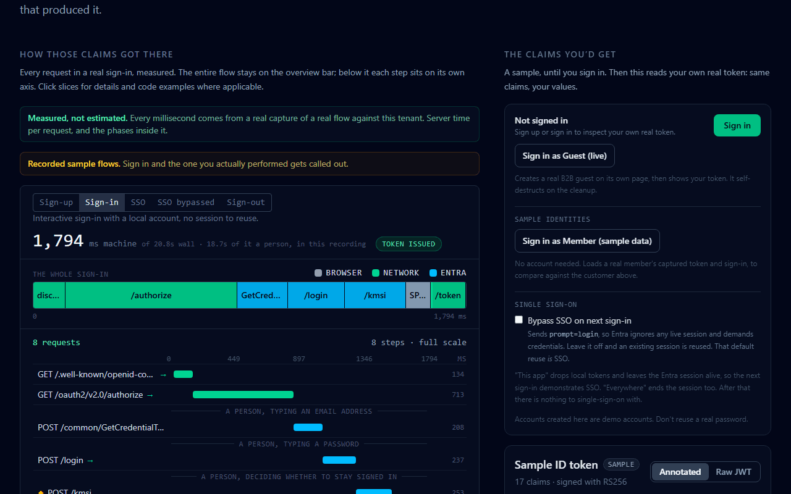
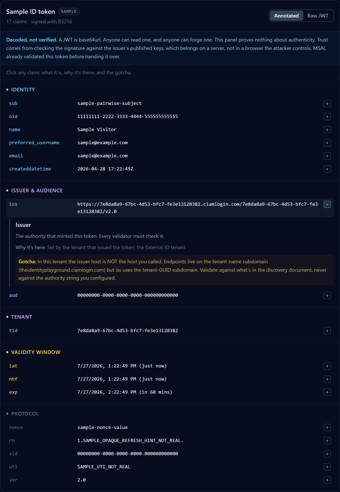
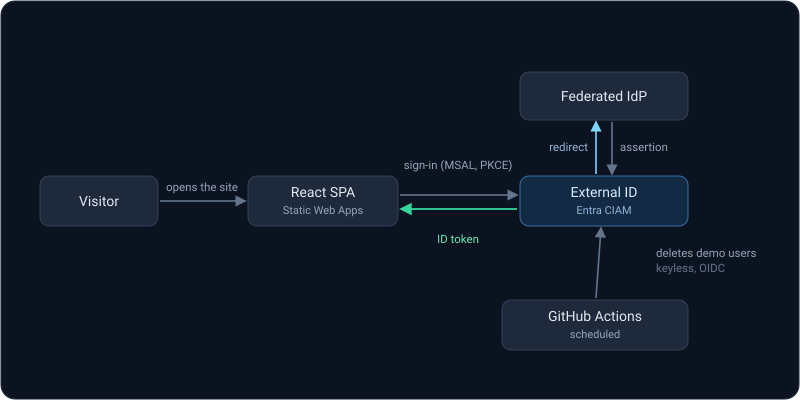

# The Identity Playground

Identity work is invisible in production. This site makes it visible: sign in against a
real Microsoft Entra tenant, then read the token that came back and every request that
produced it.

Live at https://theidentityplayground.com

<p align="center">
  
</p>

Same person, three directory objects, three different blast radiuses. No account needed to
try it. Regenerate the clip with `npm run capture --prefix web`.

Built by Steven Flanagan.

## Status

Modules 1, 2 and 5 are built and deployed, along with the self-destruct job behind all of
them.

Module 5, live SCIM provisioning, is at
[/scim](https://theidentityplayground.com/scim) and needs no account at all. Press a button
and a demo employee is created in a real Entra tenant, then provisioned into a downstream app
over SCIM 2.0. That app is this site's own endpoint, and Entra calls it exactly as it calls
any SaaS app.

<p align="center">
  
</p>

Every line above those icons is a request that actually happened, collected as it was made
rather than written out. Underneath, the page shows the full transcript with real bodies,
including the PATCH Entra sends to disable a user, which does not follow the SCIM
specification Microsoft asks you to implement. `Boolean("False")` is `true`, so an endpoint
that trusts the spec there enables every account it was told to disable and reports success
at both ends. The reasoning is in [ADR 013](docs/decisions/013-scim-as-functions.md).

Regenerate the clip with `npm run capture:scim --prefix web`. It drives a real hire, so it
creates a real demo employee, which self-destructs like any other.

Module 1, the token inspector, reads the visitor's own ID token and annotates every claim.
The sign-in that produced it sits on a timeline built from real captures against this
tenant. Nothing on it is estimated.

<p align="center">
  
</p>

Every claim expands into what it is, why it is in the token, and the gotcha that bites you
in production. Regenerate the still with `npm run capture:inspector --prefix web`.

Module 2, at [/accounts](https://theidentityplayground.com/accounts), puts three account
types side by side: a customer, an employee, and a B2B guest. The customer and the guest are
live sign-ins that mint real tokens. The employee is a captured sample, because a visitor
cannot be an employee.

Module 7, at [/cleanup](https://theidentityplayground.com/cleanup), is the job that deletes
every demo account, with its real run history.

**Each module is its own page.** They started stacked on the homepage, which ran to nine
screenfuls on a phone before someone said the site felt crowded. None of them needs the
sign-in machinery the homepage is built around, so a page each is the honest shape rather
than a tidying trick. The homepage is now the token inspector and the timeline: your token,
and the requests that produced it.

More is planned, but the homepage no longer advertises it. A list of unbuilt modules made a
finished set of demonstrations read as an unfinished product, so what ships next is tracked in
the repo rather than promised on the site.

## What it costs to run

About ten dollars a month, and that constraint has decided real architecture rather than
just being noted. Static Web Apps on the free tier, Azure Functions on consumption, Table
Storage, a DNS zone, and one Entra ID P1 for the features that need it.

The SCIM endpoint runs as Functions in the existing app rather than as a container, which
removed the only unbounded resource the design had
([ADR 013](docs/decisions/013-scim-as-functions.md) retires
[ADR 001](docs/decisions/001-container-apps-over-container-instances.md)). Passkeys were
dropped from a planned module because the custom URL domain they require in an external
tenant needs Azure Front Door at roughly $35/month, three and a half times the whole budget
([ADR 011](docs/decisions/011-drop-passkey-from-auth-methods.md)).

It runs a live sign-up form, and the guest door creates a real directory object. Nothing
linked to either until the public-readiness checklist in
[the build spec](identity-playground-spec.md) passed, on 20 July 2026.

Demo accounts are deleted between 24 and 30 hours after they are created: a 24-hour TTL,
swept by scheduled jobs holding no stored credential. Both sweeps run unattended, and both
have removed and permanently purged real expired accounts.

## Why there are three tenants

| Tenant | Role |
|---|---|
| External ID | Customer sign-up and sign-in. Everything a visitor touches. |
| Demo workforce | Module 2's employee and the B2B guests visitors create. SCIM lands here later. |
| Personal | Never issues a token to anyone. It owns the Azure subscription that pays for hosting. |

Visitors only ever authenticate against a throwaway demo tenant. Hosting lives in one
resource group in a personal subscription. A DNS zone and a static file host hold no
identity.

No real account or record belongs in either demo tenant. Every demo account is assumed
compromised.

## Architecture

<p align="center">
  
</p>

The SPA (hosted in a personal subscription) is the only thing a visitor touches. Identity
lives in a throwaway demo tenant. External ID reaches out to the federated provider and
returns the token. The scheduled cleanup is the one path that crosses into that tenant, and
it holds no secret to do it.

React SPA on Azure Static Web Apps, deployed from `main` by GitHub Actions. Entra does the
identity work. The backend in `api/` is a standalone Azure Functions app, deployed keyless
from `main`, with per-IP rate limiting in place ahead of the Graph-backed endpoints; the
front end does not call it yet.

```
web/       React SPA (Vite, Tailwind, TypeScript)
api/       Azure Functions (TypeScript), deployed standalone. Health + a rate-limited probe
scripts/   PowerShell and the Graph SDK for demo account cleanup, plus a HAR-to-timings helper
docs/      Architecture, tenant setup, decision index
```

More in [docs/architecture.md](docs/architecture.md).

## Running it

```bash
npm install --prefix web
npm run dev --prefix web      # http://localhost:5173
npm test --prefix web
```

No configuration and no secrets. Sign-in works against the live tenant from localhost. The
tenant ID and client ID are compiled in because neither is a secret: both travel in every
authorize request and sit in the token. A client secret cannot appear here at all, since
this is a public client using PKCE.

## Design and decisions

[identity-playground-spec.md](identity-playground-spec.md) is the build spec: module
designs, security rules, phase gates. [docs/decisions/](docs/decisions/) indexes them,
each a short ADR of what was chosen and what was rejected. None remain open.
